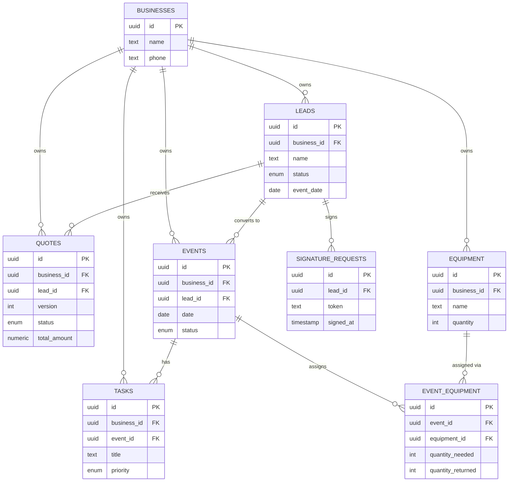

# Sparkio

A CRM built for small event-industry businesses — catering, bar service, equipment rental — to manage the full pipeline from first lead to delivered event. It replaces WhatsApp threads and spreadsheets with one place to track leads, send quotes, collect signatures, and run event logistics.

## Key features
- Lead pipeline (Kanban) with sources (WhatsApp, Instagram, manual entry)
- Quote builder with PDF export and version history
- Online digital signature collection — client signs, quote auto-updates to approved
- Event calendar and scheduling
- Task management shared between a dashboard view and per-event checklists
- Equipment & inventory tracking per event (assigned vs. returned quantities)
- Supplier directory
- Payment tracking per event
- Analytics dashboard
- Multi-tenant by design — Postgres Row-Level Security enforces that each business only ever sees its own data

## Tech stack
Next.js 16 (App Router) · React 19 · TypeScript (strict) · Tailwind CSS v4 · Supabase (Postgres, Auth, Storage, Row-Level Security) · `@react-pdf/renderer` for quote PDFs · Jest + React Testing Library

## Database design

_Core entities only — the full schema has 17 tables (adds suppliers, inventory, employees, documents, checklists, payments, reminders)._

A single `businesses` table anchors every other table through `business_id`, and tenant isolation is enforced at the database layer with Postgres Row-Level Security (a `get_my_business_id()` helper, not application-level checks) — so a bug in app code can't leak one business's data to another. Quotes and signatures attach to a **lead** rather than an **event**, keeping the pre-sale pipeline separate from confirmed-booking logistics, since a lead can carry multiple quote versions before ever becoming an event. Junction tables like `event_equipment` track per-assignment quantities (needed vs. returned) separately from the shared resource pool, so the same equipment catalog can serve many events without duplicating data.

## Analytics
The analytics page is a Server Component that runs four scoped Supabase queries in parallel (for the selected period — month / 3 months / year) and does all aggregation in plain TypeScript — there's no SQL view or RPC for this, only the `get_my_business_id()` auth helper. It shows:
- Total revenue — sum of `budget` on leads that reached `closed` status in the period
- Conversion rate — % of leads *created* in the period that reached `closed` status
- Leads funnel by status (new → in_progress → quote_sent → negotiation → closed/lost)
- Lead sources breakdown (WhatsApp / Instagram / manual)
- Monthly revenue and event-count trends over the last 12 months

## Screenshots
_Coming soon — screenshots of the dashboard, lead pipeline, and quote flow will go here._

| Dashboard | Lead pipeline | Quote & signature |
|---|---|---|
| _placeholder_ | _placeholder_ | _placeholder_ |

## What I learned
- Designing multi-tenant Row-Level Security from the ground up, and enforcing tenant isolation at the database layer instead of trusting application code to get it right every time.
- Modeling a real sales pipeline (lead → quote → signature → event) in SQL, including evolving the schema under changing requirements (e.g. migrating quotes from fixed line-items to a flexible JSON spec without breaking existing data).
- Directing AI-assisted development effectively: owning the product and data-model decisions myself, and reviewing/testing generated code rather than accepting it blindly.
- Scoping and building a real, non-trivial product end-to-end as a solo project.

## Roadmap
- Unified WhatsApp/Instagram inbox (Chatwoot integration) — groundwork is in place, UI not yet built.

## Source code
The full source is in a private repository and available on request.

## About this project
Built with AI-assisted development (Claude Code). I was responsible for product design, data modeling, and architecture decisions; AI assistance was used for implementation.
